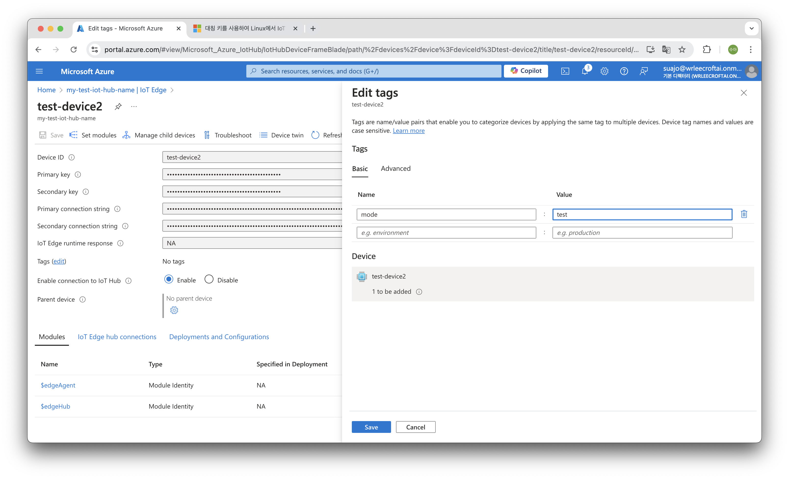

# iot
azure iot hub 테스트 레포지터리입니다.

## 참고사항
- 배포를 하기 위해서는 iot edge 디바이스만 가능합니다. 일반 디바이스는 배포할 수 없습니다.
- 테스트를 진행하기 전 iot 기기를 준비합니다. 없는 경우 Azure VM을 만들어 테스트를 진행할 수 있습니다.
    - 저는 Azure VM을 두 개 만들어서 사용했습니다.
        - Ubuntu 20.04
        - Standard B1ms (1vCPU, 2GiB 메모리)
        - x64

## Azure IoT Hub에서 디바이스 만들기
1. Azure 포탈에서 IoT Hub에 들어간 후 Device management - IoT Edge를 클릭합니다. `Add IoT Edge Device`를 눌러 새 디바이스를 클릭합니다. `Device ID`만 작성한 후 Save를 눌러 저장합니다.


2. 확인하기
test-device1, test-device2 2개를 만들었습니다.


## VM에 IoT Edge 장치 생성 및 프로비저닝하기
- [Azure 공식 문서](https://learn.microsoft.com/en-us/azure/iot-edge/how-to-provision-single-device-linux-symmetric?view=iotedge-1.5&viewFallbackFrom=iotedge-2020-11&tabs=azure-portal%2Cubuntu)를 참고하여 진행했습니다.
- Ubuntu 20.04를 기준으로 작성했습니다. 다른 os 버전인 경우는 문서를 참고해주세요.

3. 태그 설정하기
태그를 통해 동일하게 설정된 iot edge 디바이스에 같은 컨테이너를 배포할 수 있습니다. iot edge 상세페이지에서 Tags(edit)를 클릭하여 태그를 설정해줍니다.



1. IoT Edge 설치하기

```
wget https://packages.microsoft.com/config/ubuntu/20.04/packages-microsoft-prod.deb -O packages-microsoft-prod.deb
sudo dpkg -i packages-microsoft-prod.deb
rm packages-microsoft-prod.deb
```

2. 컨테이너 엔진 설치하기. 설치 진행하겠는지에서 y를 입력하여 계속 진행합니다.

```
sudo apt-get update; \
  sudo apt-get install moby-engine
```

3. IoT Edge 런타임 설치하기. 설치 진행하겠는지에서 y를 입력하여 계속 진행합니다.

```
sudo apt-get update; \
   sudo apt-get install aziot-edge defender-iot-micro-agent-edge
```

4. 클라우드 ID로 장치를 프로비저닝합니다.

```
sudo iotedge config mp --connection-string '[IOT EDGE DEVICE CONNECTION STRING]'
```

`IOT EDGE DEVICE CONNECTION STRING`는 IoT edge 페이지에서 확인할 수 있습니다. 연결하고자 하는 iot edge device를 클릭하면 아래와 같은 화면을 보실 수 있습니다. `Primary connectin string`을 복사하여 명령어에 추가하여 실행해줍니다.


정상적으로 설정되었다면 아래와 같이 출력됩니다.


5. 적용하기한 후 확인하기

```
# 구성 변경 사항을 적용
sudo iotedge config apply

# 구성 파일 내용 확인
sudo nano /etc/aziot/config.toml
```

## 배포하기
1. IoT Hub 페이지에서 사이드바의 Configurations + Deployments를 클릭합니다. Add을 클릭한 후 Deployment를 선택합니다.


2. deployment 작성하기
2-1. 배포 이름을 설정합니다.


2-2. 컨테이너 레지스트리 권한을 설정합니다.


2-3. IoT Edge Modules를 추가합니다. Add를 누른 후 IoT Edge Module을 선택합니다.


2-4. IoT Edge Module을 작성합니다. `Module name`과 `Image URI`를 작성합니다.
저는 예전에 제가 만들어놨던 리액트 이미지를 사용하겠습니다. 작성한 후 add를 눌러 설정해줍니다.

2-5. Target Devices에서 우선 순위와 target 칸디션을 설정합니다. 저는 가장 높은 10으로 우선 순위를 설정했습니다. Target Condition에서는 iot edge 디바이스를 만들면서 설정한 tag를 작성해주면 됩니다. 아래 view Devices를 선택하면 배포를 진행할 디바이스 목록이 표시됩니다.


2-6. 그대로 Create를 눌러줍니다.


3. 배포 확인하기
정상적으로 배포가 완료되었다면 vm안에서 컨테이너가 실행되는 것을 확인할 수 있습니다.


포털에서도 정상적으로 배포된 것을 확인하실 수 있습니다.


